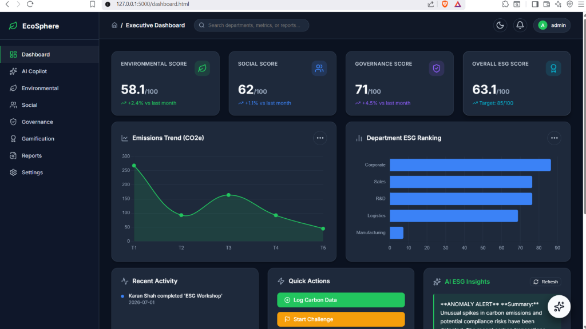
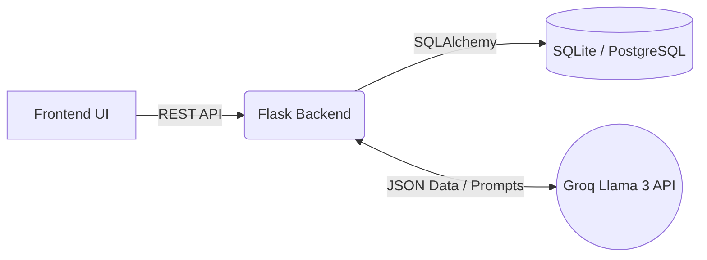

<div align="center">
  
# 🌱 EcoSphere
### **Enterprise-Inspired ESG Management Platform**

[](https://www.python.org/downloads/)
[](https://flask.palletsprojects.com/)
[](https://groq.com/)
[](https://opensource.org/licenses/MIT)

EcoSphere is a scalable platform designed for enterprise workflows to track, manage, and optimize **Environmental, Social, and Governance (ESG)** metrics. Powered by LLM-driven analysis, it transforms fragmented sustainability data into structured, actionable operational insights.

---
</div>

## 📸 Platform Sneak Peek



## 💡 The Problem vs. The Solution

**The Problem:** Modern enterprises struggle with ESG reporting. Data is siloed in spreadsheets, tracking carbon footprints is manual and error-prone, and maintaining compliance with rapidly changing governance regulations is a nightmare. 

**The EcoSphere Solution:** We built a unified, automated ERP-style platform. EcoSphere aggregates ESG data, gamifies employee participation, and uses **On-Demand AI Insights** to analyze emissions trends, flag compliance gaps, and suggest actionable carbon reduction strategies.

## ✨ Core Features

*   🌍 **Comprehensive ESG Tracking**: Track Scope 1/2/3 emissions, diversity metrics, and corporate governance policies in one unified dashboard.
*   🤖 **AI ESG Copilot**: Powered by **Groq (Llama 3 8B)**, our AI analyzes your live data on-demand to generate narrative summaries of emissions trends, scan for compliance risks, and provide smart operational recommendations.
*   🏆 **Employee Gamification**: Drives corporate culture by allowing employees to join sustainability challenges, log eco-actions, and earn badges on a real-time leaderboard.
*   💼 **Enterprise-Style UI**: A frictionless, responsive, dark-mode SaaS interface designed for professional workflows.
*   📊 **Dynamic Analytics**: Interactive charts, automated executive summaries, and department-level ESG rankings.

---

## 🏆 Competitive Advantage (Why EcoSphere Stands Out)

We engineered EcoSphere focusing on scalable architecture, resilience, and secure patterns:

1. **On-Demand AI Integration (with Offline Fallback)**: Integrated with Groq for on-demand AI summaries. *Crucially, if the API is unavailable or the internet disconnects during the demo, the system gracefully falls back to generating a local offline heuristic summary without crashing.*
2. **Security & Authentication Hardening**: 
    - Passwords are cryptographically hashed using `PBKDF2:SHA256`.
    - The authentication endpoint features an in-memory **IP-based Rate Limiter** to prevent brute-force attacks (limits rapid login attempts).
    - **Rapid Seed Setup**: For demonstration purposes, an initial seed account (`admin` / `admin123`) is generated, but the underlying system strictly enforces cryptographic storage.
3. **Database Scalability**: Natively supports both SQLite (for rapid prototyping/demo) and **PostgreSQL** (for production deployments). Just provide a `postgres://` connection string in the `DATABASE_URL`.
4. **Automated Database Seeding**: The project strictly excludes local databases (`.gitignore`). On a fresh clone, the first run automatically generates the schema and populates realistic demonstration data.
5. **Containerized Deployment**: Production-ready deployment supported via Gunicorn and a `docker-compose.yml` for instant reproducibility.

---

## 🏗️ Architecture & Flow



## 📁 Folder Structure

```text
EcoSphere-ESG-Management-Platform/
├── backend/            # Flask API, Auth, and Database Models
├── ai/                 # AI Reporting logic and prompts
├── frontend/           # Vanilla JS, CSS (Enterprise Theme), HTML UI
├── assets/             # Screenshots and visual assets
├── tests/              # Pytest suite for auth & models
├── docker-compose.yml  # Docker environment config
└── requirements.txt    # Python dependencies
```

## 🔌 Core API Endpoints

| Method | Endpoint | Description |
| :--- | :--- | :--- |
| `POST` | `/api/auth/login` | Authenticates user and returns session. |
| `GET` | `/api/dashboard/summary` | Fetches aggregated stats for the Executive Dashboard. |
| `GET` | `/api/reports/<type>` | Aggregates module data and triggers Groq AI for narrative summary. |
| `GET` | `/api/health` | Health check endpoint for load balancers and ops. |

---

## 🚀 Quick Start (Docker)

The fastest way to evaluate EcoSphere is using Docker.

1. **Clone the repository:**
   ```bash
   git clone https://github.com/rahul656676/EcoSphere-ESG-Management-Platform.git
   cd EcoSphere-ESG-Management-Platform
   ```
2. **Configure Environment:**
   Copy the example environment file and add your **Groq API Key**.
   ```bash
   cp .env.example .env
   ```
3. **Run with Docker Compose:**
   ```bash
   docker-compose up --build
   ```
4. **Access the platform:** Navigate to `http://localhost:5000`
   *Default Demo Login:* `admin` / `admin123`

## 💻 Local Development (Without Docker)

1. **Create a virtual environment and install dependencies:**
   ```bash
   python -m venv venv
   source venv/bin/activate  # On Windows use: venv\Scripts\activate
   pip install -r requirements.txt
   ```
2. **Set your API Key:** Set `GROQ_API_KEY` in your environment variables.
3. **Start the application:**
   ```bash
   cd backend
   python app.py
   ```

---
<div align="center">
<i>Built with ❤️ for a sustainable future.</i>
</div>
